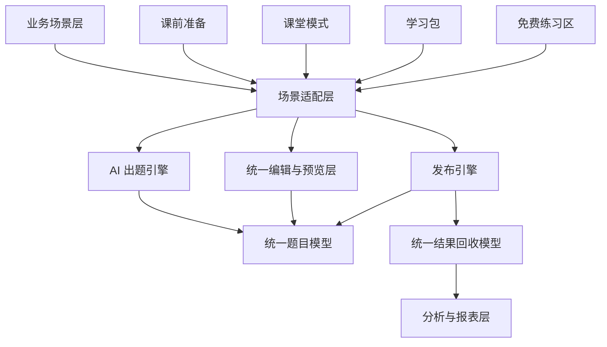

# OwnEnglish AI 出题与发布引擎设计文档 v0.2

- 日期：`2026-03-24`
- 范围：`平台级能力设计`
- 当前定位：`业务先服务英语，能力先 AI 平台化`
- 关联文档：
  - `docs/ownenglish-prd.md`
  - `docs/pre-class-preparation-prd.md`

## 1. 文档目标

本文件定义 OwnEnglish 未来直接进入开发的能力底座。

当前需要平台化沉淀的核心能力不再是“手动任务设计”，而是：

1. `AI 出题引擎`
2. `结构化题目模型`
3. `统一预览与编辑能力`
4. `统一发布引擎`
5. `统一结果回收模型`

一句话定义：

**对外先做英语教学产品，对内先做 AI 出题与发布引擎。**

---

## 2. 能力升级后的核心范式

旧范式：

`老师手动创建题目 -> 编辑 -> 发布`

新范式：

`老师提供内容或需求 -> AI 识别/生成 -> 结构化题目 -> 预览 -> 修改 -> 发布`

也就是说，平台级能力的核心已经从“手工设计器”转成：

**AI 生成结构化题目草稿 + 人工确认编辑**

---

## 3. 为什么要平台化

AI 出题能力未来不会只服务课堂任务，还会复用到：

1. 课堂实时任务
2. 课后学习包
3. 免费练习区
4. 更多语言类目
5. 未来其他学习类型

如果每个场景都单独做：

1. AI 输入链路会重复
2. 结构化题目 schema 会分裂
3. 编辑器会重复开发
4. 随机展示逻辑会重复
5. 发布逻辑会不一致
6. 结果分析口径会分裂

所以这次应该平台化的是：

1. AI 输入与解析能力
2. 统一题目 schema
3. 统一 AI 输出到编辑器的桥接层
4. 统一预览与修改能力
5. 统一发布与结果回收能力

---

## 4. 总体架构



### 4.1 业务场景层

继续以英语教学为主，包括：

1. 课前准备
2. 课堂模式
3. 学习包
4. 免费练习区

### 4.2 场景适配层

负责把同一套 AI 能力和题目能力包装成不同场景下的流程。

例如：

1. 课前准备：AI 出题 + 编辑 + 发布检查
2. 课堂模式：待发布调用 + 实时发布
3. 学习包：非实时发布 + 学生自 paced 完成

### 4.3 AI 出题引擎

负责：

1. 导入内容识别
2. 自然语言生成题目
3. 输出结构化题目
4. 标记置信度

### 4.4 统一编辑与预览层

负责：

1. 接收 AI 输出
2. 转成可编辑结构
3. 提供统一预览
4. 提供人工修正入口
5. 提供随机展示配置

### 4.5 发布引擎

负责：

1. 进入待发布
2. 实时或非实时发布
3. 会话控制
4. 结果回收

---

## 5. 核心能力边界

## 5.1 AI 出题引擎负责什么

1. 解析导入内容
2. 理解用户出题需求
3. 生成结构化题目草稿
4. 标注题型、答案、解析、知识点
5. 输出 AI 置信度

不负责：

1. 最终发布
2. 老师账号和班级逻辑
3. 学生端实时连接

## 5.2 编辑与预览层负责什么

1. 展示 AI 输出结果
2. 允许老师修改题目
3. 提供学生端预览
4. 提供随机展示策略设置
5. 做校验

不负责：

1. 重新理解原始 Word 文件
2. 执行实时发布

## 5.3 发布引擎负责什么

1. 把题目送入指定场景
2. 管理待发布、已发布、已结束状态
3. 记录发布日志
4. 回收学生提交

---

## 6. AI 出题引擎设计

## 6.1 输入方式

统一支持两种输入：

### 方式一：AI 导入识别

输入来源：

1. 文本粘贴
2. Word 上传

引擎任务：

1. 分题
2. 识别题型
3. 识别题干
4. 识别选项
5. 识别正确答案
6. 识别解析
7. 识别知识点

### 方式二：AI 需求生成

输入来源：

1. 用户自然语言
2. 题量参数
3. 难度参数
4. 题型参数
5. 是否带解析参数

引擎任务：

1. 理解知识点
2. 生成多道题
3. 生成正确答案
4. 生成解析
5. 生成建议倒计时

---

## 6.2 输出结构

AI 引擎必须输出结构化数据，而不是仅输出文本。

建议输出：

```ts
AiGenerationResult {
  sourceMode: 'ai_import' | 'ai_generate'
  rawInput?: string
  prompt?: string
  summary?: string
  questions: AiQuestionDraft[]
}
```

```ts
AiQuestionDraft {
  id: string
  type: 'single_choice' | 'multiple_choice' | 'fill_blank' | 'true_false' | 'matching'
  stem: string
  content: Record<string, unknown>
  answer: Record<string, unknown>
  explanation?: string
  knowledgePoints?: string[]
  difficulty?: 'easy' | 'medium' | 'hard'
  suggestedCountdownSeconds?: number
  confidence: 'high' | 'medium' | 'low'
  warnings?: string[]
}
```

---

## 6.3 AI 置信度策略

每题都建议保留 AI 置信度：

1. `high`
2. `medium`
3. `low`

用途：

1. 在编辑器中提示老师重点确认
2. 在发布检查页显示风险题
3. 后续统计 AI 识别效果

---

## 7. 统一题目模型

## 7.1 任务组

```ts
TaskGroup {
  id: string
  scene: 'live_classroom' | 'study_pack' | 'free_practice'
  classId?: string
  title: string
  status: 'draft' | 'ready' | 'published' | 'live' | 'archived'
  source: {
    mode: 'ai_import' | 'ai_generate'
    rawInput?: string
    fileName?: string
    prompt?: string
  }
  questions: TaskQuestion[]
  settings: TaskGroupSettings
  createdBy: string
  createdAt: string
  updatedAt: string
}
```

## 7.2 题目

```ts
TaskQuestion {
  id: string
  groupId: string
  type: string
  stem: string
  content: Record<string, unknown>
  answer: Record<string, unknown>
  explanation?: string
  media?: TaskMedia
  aiMeta?: {
    confidence: 'high' | 'medium' | 'low'
    sourceMode: 'ai_import' | 'ai_generate'
  }
  settings: TaskQuestionSettings
  order: number
  status: 'draft' | 'ready' | 'disabled'
}
```

## 7.3 题目设置

```ts
TaskQuestionSettings {
  countdownSeconds?: number
  randomizeOptions?: boolean
  randomizeAnswerPosition?: boolean
  allowPartialScore?: boolean
  caseSensitive?: boolean
  resultVisibility?: 'teacher_only' | 'student_after_end'
}
```

---

## 8. 随机答案位置能力

这是新方案下必须平台化的一项能力。

建议原则：

1. 系统保存标准选项和标准答案
2. 展示层负责随机顺序
3. 判分时使用标准 key，而不是当前位置

适用题型：

1. 单选题
2. 多选题
3. 配对题右侧列表

建议配置：

1. `off`
2. `on_publish`
3. `on_each_student`

---

## 9. 编辑与预览层设计

无论 AI 识别还是 AI 生成，最后都必须进入统一编辑层。

编辑层负责：

1. AI 输出结果列表
2. 当前题详情编辑
3. 学生端预览
4. 校验结果展示
5. 随机展示配置

统一流程：

`AI 输出 -> 预览 -> 修改 -> 校验 -> 发布检查`

---

## 10. 校验层设计

校验层继续保留，但输入已经变成 AI 草稿。

校验内容包括：

1. 题干是否为空
2. 正确答案是否为空
3. 选项是否完整
4. 配对是否成对
5. 填空答案是否完整
6. 随机展示配置是否适用于当前题型

建议结构：

```ts
ValidationIssue {
  level: 'error' | 'warning' | 'info'
  scope: 'question' | 'group' | 'publish'
  targetId?: string
  code: string
  message: string
}
```

---

## 11. 发布引擎

发布引擎本轮不改大逻辑，继续承接生成后的题目。

## 11.1 实时发布

用于课堂模式：

1. 任务组进入待发布队列
2. 按题逐个发布
3. 支持暂停和结束
4. 记录课堂会话结果

## 11.2 非实时发布

用于学习包或免费练习：

1. 整包发布
2. 学生按节奏完成
3. 记录结果

---

## 12. 开发阶段建议

既然当前决定不再先做方案验证，而是直接进入开发阶段，建议按下面顺序拆分：

### 第一阶段

1. 文本粘贴识别
2. Word 上传识别
3. 自然语言生成题目
4. 统一题目 schema
5. 统一编辑与预览层
6. 随机展示配置

### 第二阶段

1. 接入课堂模式待发布队列
2. 接入学习包
3. 接入统一结果回收

### 第三阶段

1. AI 质量优化
2. 题库沉淀
3. 更多题型

---

## 13. 当前明确不做的旧方案

本轮不再按“手动设计器优先”推进。

也就是说：

1. 不再把手动从零创建作为主路径
2. 不再把复杂手工编排作为第一开发重点
3. 不再先做纯人工设计验证再切 AI

当前明确采用：

**AI 驱动创建，人工确认编辑。**

---

## 14. 结论

OwnEnglish 当前的课前准备能力，已经应当从“任务设计器”切换为“AI 出题工作台”。

对开发的直接指导是：

1. 先做 AI 输入和结构化输出
2. 再做统一编辑与预览
3. 最后接入发布引擎

这样可以在不改变整体产品方向的情况下，最快进入 AI 驱动开发阶段。
