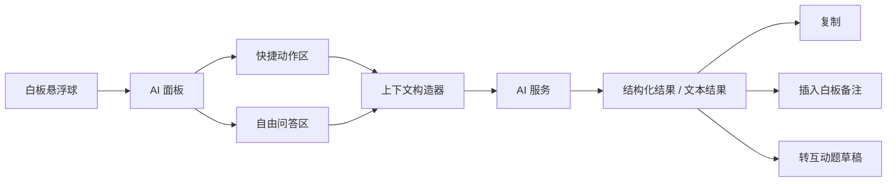

# 白板 AI 助手设计稿 v1

## 1. 目标

在白板模式下新增一个教师端 AI 助手，用于：

- 基于当前白板内容即时问答
- 帮老师总结、解释、提炼白板内容
- 基于当前板书生成课堂检测题或追问
- 降低老师临场组织语言、出题、追问的负担

这个助手的定位是：

**课堂辅助工具，不是开放聊天入口。**

## 2. 产品边界

### 本期做

- 白板模式教师端 AI 悬浮球
- AI 快捷动作
- 基于当前白板内容的问答面板
- 基于当前板书生成：
  - 总结
  - 解释
  - 检测题
  - 追问

### 本期不做

- 学生端 AI 助手
- 左侧学生列表控制增强
- 自由开放的通用聊天
- 课外泛问答
- 自动批量读取整块白板所有手写图形并完全理解

## 3. 用户角色与场景

### 角色

- 教师

### 典型场景

1. 老师讲到一半，想让 AI 总结当前板书
2. 老师需要立即生成 1 道随堂检测题
3. 老师想把当前板书改写成更适合学生理解的表达
4. 老师想围绕当前内容生成 2-3 个追问
5. 老师想问“这段板书里有没有概念错误/表达问题”

## 4. 交互形态

### 入口

白板右下角新增悬浮球：

- 默认收起
- 不遮挡白板核心工具栏
- 点击后展开 AI 面板

### 展开后的结构

AI 面板分两层：

1. 快捷动作区
2. 问答区

快捷动作优先，自由问答作为补充。

## 5. 核心功能

### 5.1 快捷动作

第一版固定 6 个快捷动作：

1. `解释当前板书`
2. `总结当前板书`
3. `提炼重点`
4. `生成检测题`
5. `生成追问`
6. `检查表达问题`

每个动作都应：

- 直接可点
- 无需老师长输入
- 输出结果可复制或插入到白板备注区

### 5.2 自由提问

老师可输入问题，例如：

- “把这段内容解释得更简单”
- “基于这一页生成 3 道单选题”
- “这一页适合怎么追问学生”

但问答仍受当前白板上下文约束，不鼓励泛聊天。

### 5.3 上下文来源

第一版上下文采用分层策略：

#### Level 1：结构化白板文本

- 文本框
- 题目文本
- 白板内结构化内容

#### Level 2：当前课堂任务内容

- 当前预览任务
- 当前进行中互动题
- 当前活动标题和题干

#### Level 3：白板截图

本期只预留接口，不默认开启。

理由：

- 第一版先保证稳定与可控
- 截图理解会引入较大噪声和成本

## 6. 响应结果设计

AI 回复分为两类：

### 6.1 结构化结果

用于快捷动作，返回固定结构，例如：

- 标题
- 重点列表
- 题目列表
- 追问列表

这类结果支持：

- 复制
- 一键插入白板便签/备注
- 一键转成互动题草稿

### 6.2 普通文本结果

用于自由问答。

支持：

- 复制
- 继续追问

## 7. UI 草图

### 7.1 页面草图

```text
┌───────────────────────────────────────────────────────────────┐
│ 白板区域                                                      │
│                                                               │
│  ┌──────────────────────┐                                     │
│  │ 当前板书 / 题目 / 图示 │                                     │
│  └──────────────────────┘                                     │
│                                                               │
│                                                   ○ AI        │
└───────────────────────────────────────────────────────────────┘
```

点击 AI 悬浮球后：

```text
┌───────────────────────────────────────────────────────────────┐
│ 白板区域                                      ┌─────────────┐ │
│                                               │ 白板 AI 助手 │ │
│                                               ├─────────────┤ │
│                                               │ 快捷动作     │ │
│                                               │ [解释] [总结]│ │
│                                               │ [重点] [出题]│ │
│                                               │ [追问] [纠错]│ │
│                                               ├─────────────┤ │
│                                               │ 问答区       │ │
│                                               │ 请输入问题   │ │
│                                               │ [发送]       │ │
│                                               ├─────────────┤ │
│                                               │ AI 返回内容  │ │
│                                               │ 可复制/插入  │ │
│                                               └─────────────┘ │
└───────────────────────────────────────────────────────────────┘
```

### 7.2 结构图



## 8. 交互规则

### 8.1 默认行为

- 默认关闭
- 仅教师可见
- 每次展开保持最近一次结果，但不永久保留长聊天历史

### 8.2 结果操作

对每条 AI 结果支持：

- `复制`
- `插入到白板`
- `继续追问`

仅对“生成检测题 / 生成追问”支持：

- `转成互动草稿`

### 8.3 错误处理

出现以下情况时给明确提示：

- 当前白板没有可用内容
- AI 响应失败
- 响应超时
- 当前动作暂不支持

## 9. 技术架构建议

为了保证白板大文件可运维，AI 能力必须独立成 feature slice，不直接堆进 `WhiteboardMode.tsx`。

### 推荐拆分

#### 页面层

- `client/src/pages/teacher/WhiteboardMode.tsx`

职责：

- 只负责挂载入口
- 不直接实现 AI 逻辑

#### 组件层

- `client/src/features/whiteboard-ai/components/WhiteboardAiLauncher.tsx`
- `client/src/features/whiteboard-ai/components/WhiteboardAiPanel.tsx`
- `client/src/features/whiteboard-ai/components/WhiteboardAiQuickActions.tsx`
- `client/src/features/whiteboard-ai/components/WhiteboardAiResponseCard.tsx`

#### Hook 层

- `client/src/features/whiteboard-ai/hooks/useWhiteboardAi.ts`

职责：

- 当前会话状态
- loading/error
- 执行动作
- 消息流

#### 上下文层

- `client/src/features/whiteboard-ai/context/whiteboardAiContextBuilder.ts`

职责：

- 从白板对象提取结构化文本
- 读取当前任务和互动题内容
- 统一构造 prompt context

#### 服务层

- `client/src/features/whiteboard-ai/services/whiteboardAiService.ts`

职责：

- 请求后端 AI 接口
- 不参与 UI 和状态管理

#### Prompt 模板层

- `client/src/features/whiteboard-ai/prompts/`

建议拆成：

- `summarizePrompt.ts`
- `explainPrompt.ts`
- `quizPrompt.ts`
- `followupPrompt.ts`
- `reviewPrompt.ts`

## 10. 后端接口建议

第一版建议只做 1 个主接口：

- `POST /api/v1/whiteboard-ai/respond`

请求体建议：

```json
{
  "action": "summarize",
  "question": "",
  "context": {
    "whiteboard_text": "...",
    "task_title": "...",
    "task_prompt": "...",
    "class_id": "...",
    "mode": "whiteboard"
  }
}
```

返回建议：

```json
{
  "type": "structured",
  "title": "本页重点",
  "content": ["重点1", "重点2"],
  "raw_text": "..."
}
```

## 11. 可运维性要求

### 11.1 Feature Flag

增加白板 AI 功能开关：

- 教师端灰度可控
- 出问题时可快速关闭

### 11.2 统一上下文构造

所有 AI 调用必须共用同一套上下文构造逻辑，不能各个按钮自己拼 prompt。

### 11.3 日志

至少记录：

- 动作类型
- 是否成功
- 响应耗时
- 是否有可用上下文

### 11.4 模板独立

提示词模板不得写死在组件里，必须独立维护。

## 12. 实施顺序

### 第一步

先拆白板页挂载能力：

- 增加 `WhiteboardAiLauncher`
- 增加 `WhiteboardAiPanel`

### 第二步

实现 `useWhiteboardAi`

### 第三步

实现 4 个核心动作：

- 解释
- 总结
- 生成检测题
- 生成追问

### 第四步

补“插入到白板 / 转互动草稿”

## 13. 验收标准

### 产品验收

- 老师能从白板右下角打开 AI 助手
- 快捷动作可直接使用
- AI 回答明确围绕当前白板内容
- 能复制结果
- 能把结果插入白板

### 技术验收

- 不继续加重 `WhiteboardMode.tsx`
- AI 功能模块化拆分完成
- 上下文构造、Prompt、服务层解耦
- 白板原有主链路不受影响

## 14. 后续扩展

后续可考虑：

- 白板选区问答
- 截图理解
- 学生端受控 AI 助手
- AI 直接生成互动题并进入预发布队列

但这些不纳入 v1。
